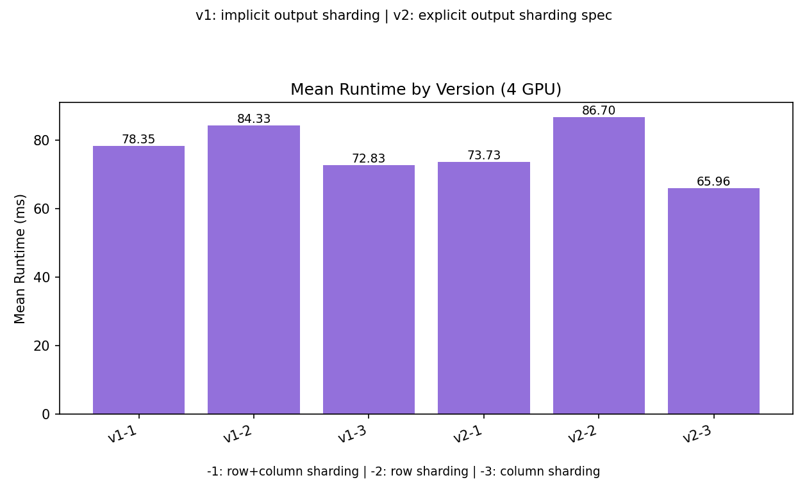
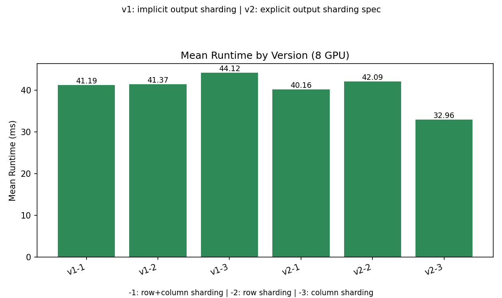
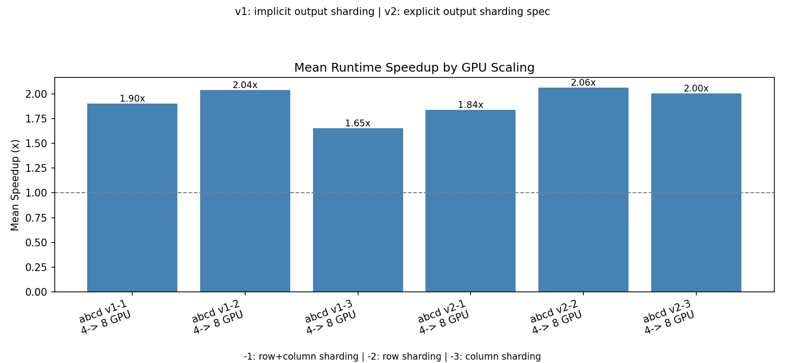
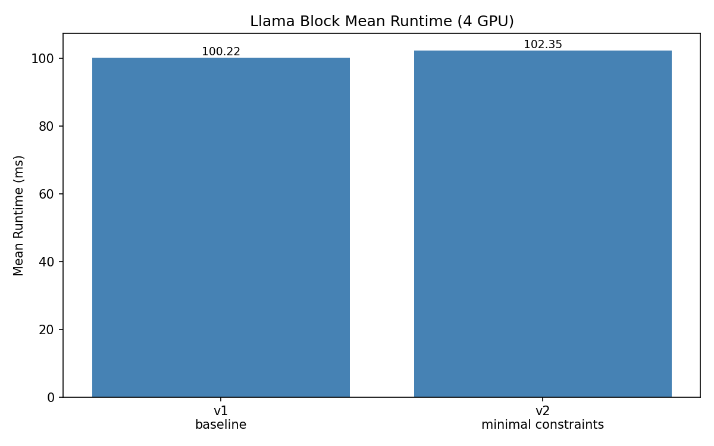
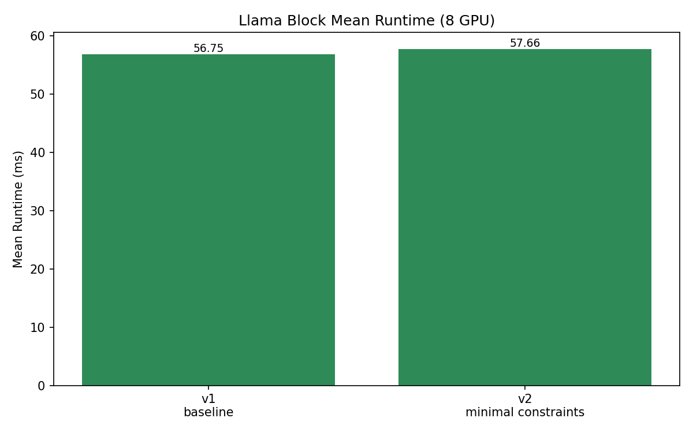
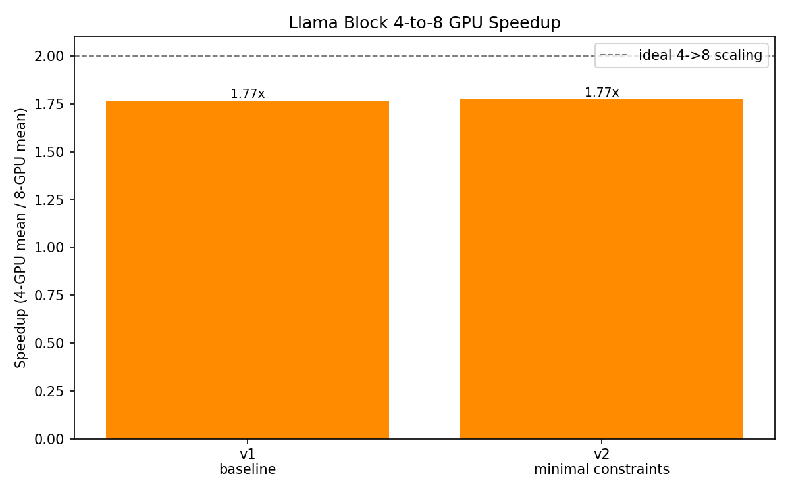

# JAX Practice Benchmarks

This directory contains two benchmark suites for comparing JAX sharding strategies on
multi-GPU NVIDIA V100 systems.

## Contents

- `abcd/`: matrix-chain benchmark for `a @ b @ c @ d`.
- `llama/`: single Llama decoder block benchmark.

Each benchmark suite includes standalone scripts, a shared `benchmark_api.py`,
a `run_all_benchmarks.sh` runner, generated result data, plot helpers, and a
findings report.

## GPU Topologies

The scripts are organized around these logical meshes:

- 4 GPU: one V100 island, mesh `(2, 2)`.
- 8 GPU: two V100 islands, mesh `(2, 4)`.

The ABCD benchmarks use mesh axis names `("island", "lane")`. The Llama block
benchmarks use `("x", "y")`, where `x` primarily represents sequence
parallelism and `y` represents head, tensor, or FFN intermediate parallelism.

## ABCD Benchmark

The `abcd/` suite compares sharding layouts for the expression `a @ b @ c @ d`.
It includes 4-GPU and 8-GPU variants for:

- `v1-*`: `jnp.linalg.multi_dot` pipeline.
- `v2-*`: explicit stepwise matmul pipeline with intermediate constraints.
- `-1`, `-2`, `-3`: different operand sharding layouts.

Run from the project root:

```bash
cd abcd
./run_all_benchmarks.sh --n 8192 --warmup 2 --steps 10 --dtype float32
```

See `abcd/README.md` for the file layout and `abcd/FINDINGS_REPORT.md` for the
recorded results.

**ABCD plots** (mean runtime on 4 / 8 GPUs and 4→8 speedup; data in
`abcd/8129_data/`, matrix size `8192 × 8192` per `FINDINGS_REPORT.md`):







Additional figures for the run saved under `abcd/16284_data/` are shown in
`abcd/README.md`.

## Llama Block Benchmark

The `llama/` suite benchmarks one configurable Llama block with RMSNorm,
Q/K/V projection, RoPE, causal GQA attention, output projection, residuals, and
a gated FFN.

It currently includes:

- `v1`: explicit constraints through major attention and FFN intermediates.
- `v2`: minimal manual constraints at major phase boundaries.

Run from the project root:

```bash
cd llama
./run_all_benchmarks.sh --seq 8192 --dtype float32 --warmup 2 --steps 10
```

For a small smoke run:

```bash
cd llama
python3 llama_4gpu_v1.py \
  --seq 16 \
  --hidden 64 \
  --heads 4 \
  --kv-heads 2 \
  --head-dim 16 \
  --ffn 128 \
  --dtype float32 \
  --warmup 1 \
  --steps 1
```

See `llama/README.md` for the file layout and
`llama/LLAMA_BLOCK_FINDINGS_REPORT.md` for the recorded results.

**Llama block plots** (same metrics; data in `llama/data/`):







## Plotting

Plot scripts need a Python environment with Matplotlib installed.

After JSON result files exist, generate plots from the saved ABCD directories
`abcd/8129_data/` or `abcd/16284_data/`, or from `llama/data/`:

```bash
cd abcd/8129_data
python3 plot_mean_runtime_4gpu.py
python3 plot_mean_runtime_8gpu.py
python3 compare_gpu_speedup.py
```

```bash
cd llama/data
python3 plot_mean_runtime_4gpu.py
python3 plot_mean_runtime_8gpu.py
python3 compare_gpu_speedup.py
```

The plots summarize **mean** runtime on 4 GPUs, mean runtime on 8 GPUs, and
4-to-8 GPU speedup (ratio of means). To regenerate the `16284_data` figures,
run the same three commands under `abcd/16284_data/`.

## Output Contract

Benchmark scripts write JSON payloads with:

- compile time.
- warmup timings.
- timed run timings.
- average, median, min, max, and standard deviation.
- effective TFLOPS.
- mesh shape, mesh axis names, topology, dtype, and sharding settings.

Keeping this schema stable lets the plotting scripts and findings reports stay
comparable across benchmark variants.
